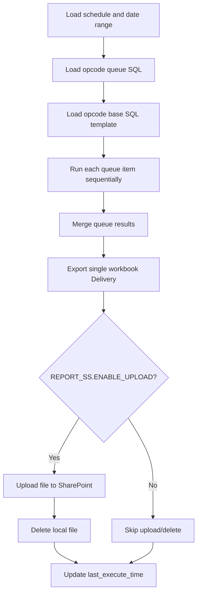

# Job: DAD_DAILY_REPORT_DC_DESTINATION

Daily Time Table DC report with flow identical to DAD_DAILY_REPORT_DC_DESTINATION.

| Item | Value |
|------|-------|
| Schedule | Daily |
| Query Source | src/sql/dc_report/opcode_30.sql & opcode_45.sql |
| Execution Model |daily |
| Output File |  dad_report_daily_30_45_dc_YYYYMMDD.xlsx |
| Output Sheets | opcode_30 & opcode_45 |
`DAD_DAILY_REPORT_DC_DESTINATION` | Job Implementation(
See [src/jobs/report_autoclaim_tkpd.py](../../src/jobs/dad_report_daily_54_31_603_dc.py)) |
| Upload Step | Present but disabled by default (`DAD_Daily_Report_Leadtime_Productivity_DC.ENABLE_UPLOAD=false`) |
| Delete Local File Step | Present but disabled by default (`DAD_Daily_Report_Leadtime_Productivity_DC.ENABLE_UPLOAD=false`) |

## Flow Process



## Running

```sh
python -m src.main --job-code DAD_DAILY_REPORT_DC_DESTINATION
```

With override date:

```sh
python -m src.main --job-code DAD_DAILY_REPORT_DC_DESTINATION --reference-date 2026-06-03
```

## Upload and Delete Step Policy

- Upload file step is kept in code and can be re-enabled later.
- Delete local file step is kept in code and can be re-enabled later.
- Current default for dc is disabled unless config sets `DAD_DAILY_REPORT_DC_DESTINATION.ENABLE_UPLOAD=true`.

## Scheduler Integration / Config

1. Register metadata in logging.etl_job.
2. Register process switch in analysis_services.config_process_switch.
3. Optional runtime toggle for SS upload:

```yaml
dc_report:
  ENABLE_UPLOAD: false
```

## Notes

- This job is created as a non-intrusive clone and does not modify DAD_DAILY_REPORT_DC_DESTINATION flow/files.
- Mapping changes for opcode_queue and output/base query can be updated in src/sql/dc_report/ only.
